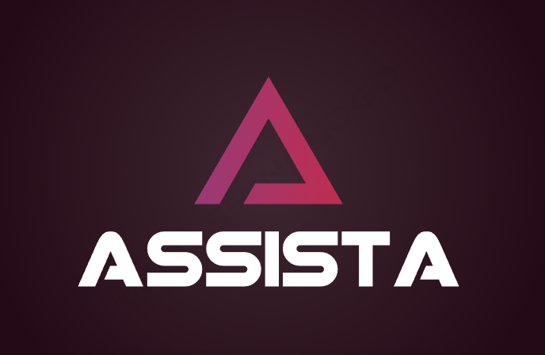
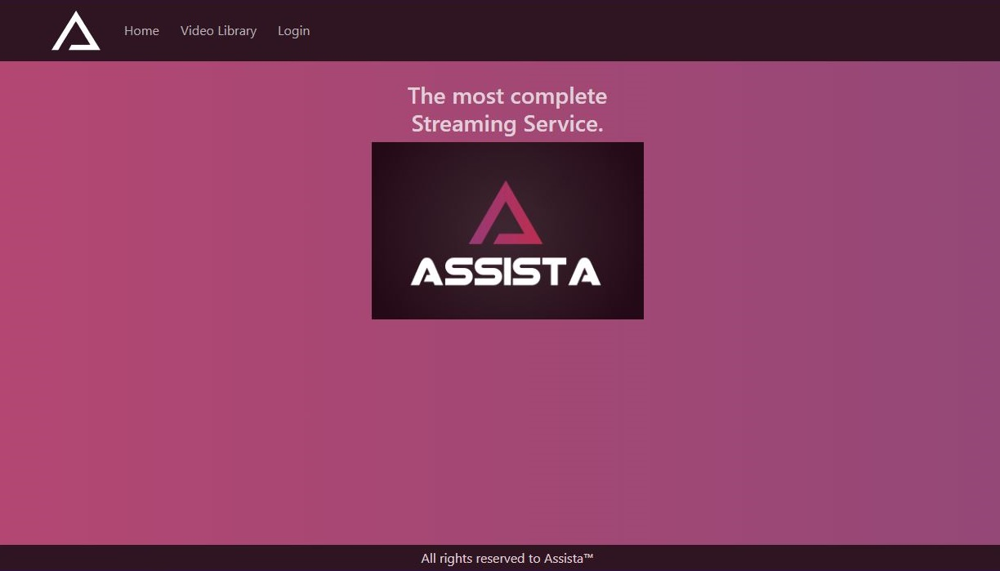
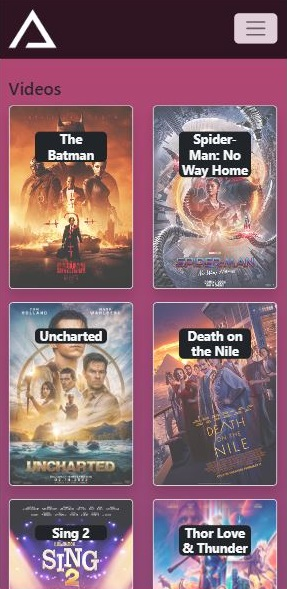
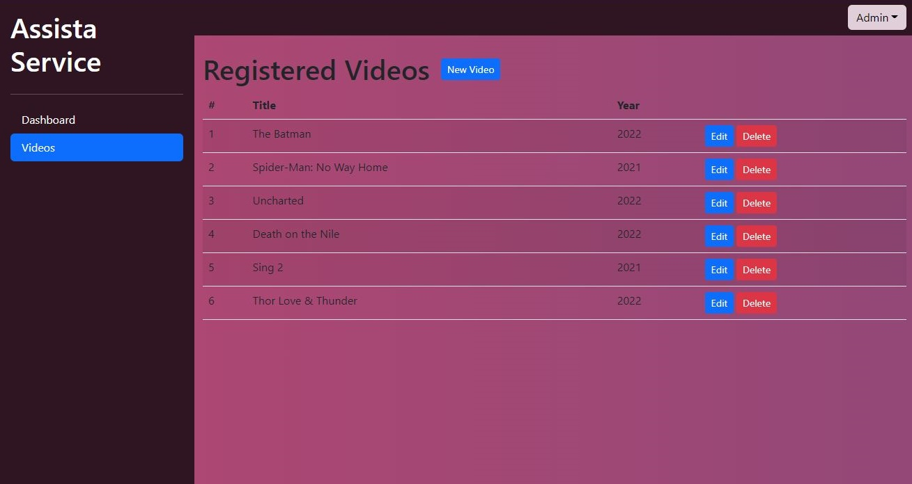

[![LinkedIn][linkedin-shield]][linkedin-url]

<!-- PROJECT LOGO -->
 

  
   

<h3 align="center">Assista</h3>

  

    Plataforma de stream (mocked) que permite gerenciar o catálogo de vídeos
     
     
    <a href="https://gitlab.com/Brunnosama/stream-service"><strong>Explore a documentação »</strong></a>
     
     
    <a href="https://stream-service.vercel.app/">Veja a Demo</a>
    ·
    <a href="https://gitlab.com/Brunnosama/stream-service-api">Explore a API</a>
    ·
    <a href="https://gitlab.com/Brunnosama/stream-service-api/-/issues">Reporte um Bug</a>
  

<h4 align='center'>✔️ Projeto Concluído ✔️</h4>

  
   
  

<!-- TABLE OF CONTENTS -->

  
Sumário

  <ol>
    <li>
      <a href="#sobre-o-projeto">Sobre o Projeto</a>
      <ul>
        <li><a href="#construído-com">Construído com</a></li>
      </ul>
    </li>
    <li><a href="#contato">Contato</a></li>
  </ol>

<!-- ABOUT THE PROJECT -->
## Sobre o Projeto

Este projeto tem um objetivo educacional, como parte do curso Bootcamp em Desenvolvimento Front-end com React do <a href="https://curso.infnet.edu.br/bootcamp/desenvolvedor-front-end-react/">Instituto Infnet</a>. O projeto consiste num Web Service mockado de uma plataforma de stream, que permite aos usuários acessarem os vídeos e favoritar os seus vídeos preferidos. Os administradores podem editar o catálogo de vídeos já existente, acrescentando novos vídeos ou excluíndo. Todo o serviço passa por um protocolo de autorização que impede clientes de acessarem as rotas privadas dos administradores. Neste ponto do projeto, ainda não é possível incluir imagens nos novos vídeos cadastrados.

### Construído com

* [React.js](https://reactjs.org/)
* [Bootstrap](https://getbootstrap.com)

<!-- CONTACT -->
## Contato

Brunno Manoel Azevedo Pessôa - apbrunno@gmail.com

Link do Projeto: [https://gitlab.com/Brunnosama/stream-service](https://gitlab.com/Brunnosama/stream-service)

(<a href="#top">volte ao topo</a>)

<!-- MARKDOWN LINKS & IMAGES -->
<!-- https://www.markdownguide.org/basic-syntax/#reference-style-links -->
[contributors-shield]: https://img.shields.io/github/contributors/github_username/repo_name.svg?style=for-the-badge
[contributors-url]: https://github.com/github_username/repo_name/graphs/contributors
[forks-shield]: https://img.shields.io/github/forks/github_username/repo_name.svg?style=for-the-badge
[forks-url]: https://github.com/github_username/repo_name/network/members
[stars-shield]: https://img.shields.io/github/stars/github_username/repo_name.svg?style=for-the-badge
[stars-url]: https://github.com/github_username/repo_name/stargazers
[issues-shield]: https://img.shields.io/github/issues/othneildrew/Best-README-Template.svg?style=for-the-badge
[issues-url]: https://gitlab.com/Brunnosama/stream-service-api/-/issues
[license-shield]: https://img.shields.io/github/license/othneildrew/Best-README-Template.svg?style=for-the-badge
[linkedin-shield]: https://img.shields.io/badge/-LinkedIn-black.svg?style=for-the-badge&logo=linkedin&colorB=555
[linkedin-url]: https://www.linkedin.com/in/brunno-azevedo-pessoa/
[product-screenshot]: images/screenshot.png
